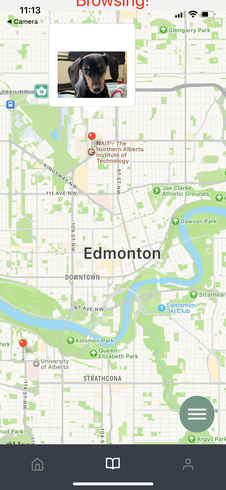

  

# SpotTheDog App
###### A project written at
#### HackED 2023,
###### a 24-hour hackathon hosted by
#### University of Alberta Computer Engineering Club

## Our goal is to rescue missing dogs by matching images through face recognition techniques. 
#### To do so, we employed _machine learning_ in image processing, _established_ a database and storage of dog images, and _built_ an app on which users could upload the images of either wandering or missing dog.
---
- Countless dog owners have gone through the painful experience of searching for their missing dogs. _Extremely laborious_ it is - to post the pictures of their lost dogs both online and offline. Adding to this challenge, the anxious owners would look for their missing dogs on many social media and platforms, _scrolling through the ocean of information_. A government-run institution for sheltering lost pets does exist somewhere, but they tend to be slow and their service comes with the _possibility of death of beloved pets_ unless the owners hastily pick them up in time. **SpotTheDog App** is a platform on which both the anxious owners and the caring witnesses of wandering dogs to upload dog images with location information. The application would then match the images of same dogs. This allows _everyone_ to be involved in the effort of rescue and accelerates the searching process.
---
## Functionality
- SpotTheDog App takes user inputs, such as images and location information.
- It processes images through machine learning for dog face detection and recognition.
- It saves the input information in a database along with meta data.

## SpotTheDog App

## Machine Learning (ML) Model, <code>spot_the_dog_model.py</code>

The major components of our ML model are <code>opencv</code>, <code>dlib</code>, and <code>face_recognition</code> packages, which are essential in detecting and recognizing faces. We combined and modified their functionalities to create our own model

### Detected Face

As shown in the image above, it detects the face well with facial landmarks such as eyes, ears, and noses. However, the major limitation is that it detects only frontal faces. We will bbe continuously working on the ML model to overcome this limitation.

### Registered Face

  

### Unmatched Face

  

The first figure is the image of a reported dog supplied by a witness and uploaded to the app. Its face encoding is stored in the dtabase, and the data will be used to recognize incoming images of missing dogs, for example, shown in the second image. It compares the missing dog's face encoding with a list of reported dogs' face encodings. As a result, the matched faces with certain similarities are tagged to the missing dog. When browsing missing dogs, the similar dogs are matched and tagged.   

### App Preview

  
  
  

The documentations of employed ML packages are listed below.

> <code>dlib</code> Documentation: http://dlib.net/  
> <code>face_recognition</code> Documentation: https://face-recognition.readthedocs.io/en/latest/face_recognition.html  
> Data File  

---
# About Project and Team
## Our Noteworthy Achievements
- **Originality**:
    - Currently, there is no commercially available app similar to SpotTheDog.
- **Utility**
    - Our project _raises awareness_ on lost or stray dogs.
    - It would accelerate the searching process of missing dogs.
    - It decentralizes the tasks involved in finding and maintaining missing dogs.
- **Execution** and **Polishness**
    - Completed the _working_ project within 24 hours.
- **Complexity**
    - Quickly familiarized ourselves with new techniques / coding skills.

## Team Members:
* [Min Joh](https://github.com/CavityKingu) (ML developer)
* [Dohyun Kim](https://github.com/kdhminime) (Full-stack developer)
* [Yongbin Kim](https://github.com/yongbin4) (Back-end developer)
* [Jamie Lee](https://github.com/jamielee0629) (ML developer)
* [Taekwan Yoon](https://github.com/taekwan-yoon) (Front-end developer)
